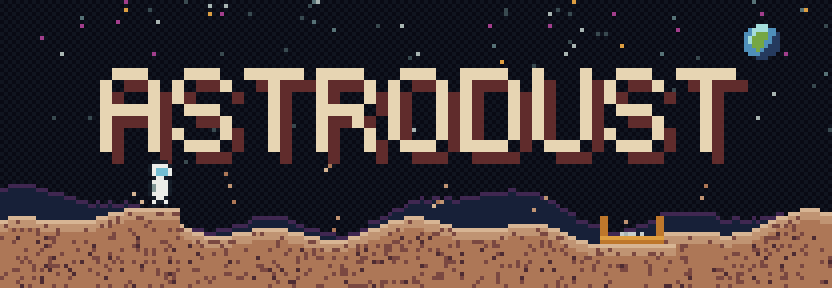
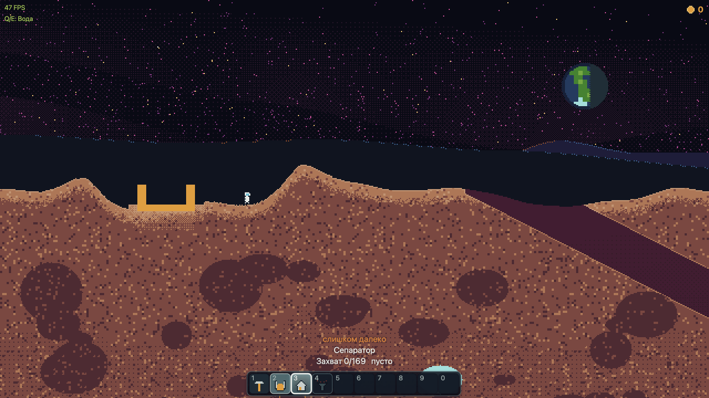
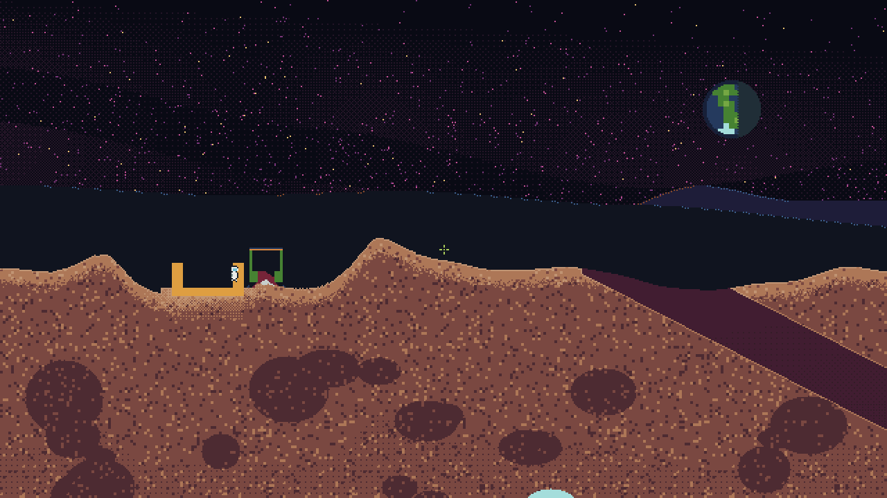
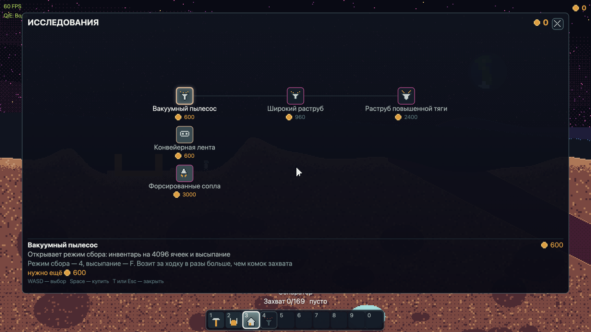

<div align="center">



**A browser game about landing on an airless world, digging it apart one pixel at a time,
and turning the rubble into an automated factory.**

*Noita × Factorio, in a canvas tag.*


</div>

---

## What is this game?

You are an astronaut in a pressure suit, standing on the Moon next to your landing module.
There is no atmosphere: the sky stays coal-black with stars at noon, Earth hangs above the
horizon as a blue dot, and every jump is high, slow and floaty because gravity is a sixth of
what you are used to.

Under your boots is regolith. You dig it, and the hole stays. You dig deeper, hit a pocket of
water ice, and the water runs downhill through your tunnel, soaks the loose regolith it touches
and turns it into pulp. Pulp is worth three times what raw regolith is — so now you have a
reason to carry it back. You drop it into the landing module, credits appear on the counter,
and you spend them on technology: a vacuum for hauling in bulk, a conveyor belt so you stop
hauling at all, better thrusters so the trip back is shorter.

Somewhere in there the game stops being about digging and starts being about layout.

**Genre-wise it is falling-sand physics plus production chains.** The mechanics take their
cues from [Sandustry](https://store.steampowered.com/app/2764460/Sandustry/) — a proven design
worth learning from rather than reinventing — while the setting, the naming and the look are
our own.

### The one idea: every pixel is a material

The world is **not** a tilemap and there is no separate collision layer. It is a single
`Uint8Array` of 2048 × 1024 cells, and each cell holds a material id. That one array is the
only source of truth about geometry: collision is sampled from it, the picture is drawn from
it, and the cellular automaton mutates it in place.

Everything people usually implement as a feature falls out of that for free:

- **Destructibility** — digging is just writing a different material into cells.
- **Piling and slumping** — powders fall, roll off slopes, and settle at their angle of repose.
- **Buoyancy** — one rule, `density`. Heavier sinks through lighter, so iridium (500) drops
  through water (100), and slag (50) floats up through it.
- **Fluids** — water finds its level and pours through any tunnel you dug, including the ones
  you did not mean to dig.
- **Reactions** — contact rules are a table, not a branch: loose regolith touching water
  becomes two cells of pulp.

### The core loop

```
        dig                     contact                   separator
rock ────────▶ regolith ──┐                        ┌──▶ iridium ──▶ 30 ₡/cell
                          ├──▶ pulp ──▶ [ machine ]│
ice  ────────▶ water   ───┘    3 ₡/cell            └──▶ slag ──▶ worthless
        dig

                    pulp or ore ──▶ [ landing module ] ──▶ credits ──▶ research
                                                                          │
                              vacuum · conveyor · wider nozzle · thrusters ┘
```

The separator takes a batch of 10 pulp cells every 0.5 s and returns 2 cells of iridium plus
8 of slag — matter is never created or destroyed, only re-labelled. Selling raw material works
too, but the machine is twice as profitable, which is what keeps it interesting rather than
mandatory.

## Status

A **playable MVP**. What is in and working today:

| Working | Not there yet |
|---|---|
| Moon world with procedural terrain, caves and ice pockets | Saves — nothing persists across a reload |
| Walking, jumping, jetpack thrust, pixel-exact collision | Other worlds (Mars, Europa) |
| Digging, grabbing, vacuuming, dumping | Enemies, combat, story, dialogue |
| Powders, liquids, gases, reactions, buoyancy | Multiplayer |
| Separator, conveyor belts, landing module | Fuel, power, heat |
| Research tree with 5 technologies | Mobile / touch controls |
| Procedural audio synthesised per mechanic | |

## Gallery

<div align="center">



*Regolith, the landing module, Earth over the horizon, and the action bar.*



*A separator chewing through pulp beside the module.*



*The research tree. Position in the graph is computed from prerequisites, never hand-placed.*

</div>

## Quick start

```bash
npm install
npm run dev        # http://localhost:5173
```

No build step is needed to play, no assets to download, no server to run — the whole game is
TypeScript compiled by Vite into one page.

## Controls

Keyboard and mouse. Direction keys aim and move at the same time; there is no separate aiming
mode.

| Input | Action |
|---|---|
| `A` `D` / `←` `→` | walk, and aim horizontally |
| `W` / `↑` | jump; hold for jetpack thrust; also aims up |
| `S` / `↓` | aim down |
| `Space` or **LMB** | apply the current tool (dig / grab / build / collect) |
| `F` or **RMB** | dump the carried material |
| `1` … `0` | pick an action-bar slot directly |
| `R` | cycle tools |
| `C` | cycle the material to dump |
| `X` | cycle the building kind |
| `Shift` | placing a single belt section: face it the other way |
| `T` | open / close the research tree (`WASD` to move, `Space` to buy, `Esc` to close) |
| `M` | mute |
| `F3` | debug overlay |
| `Q` / `E` | debug: pick a material / place it |

The input snapshot reports whether the cursor is over the interface, so clicking a slot on the
action bar only picks a tool — it does not also dig the ground hidden behind the panel.

## Tools

| Slot | Tool | What it does |
|---|---|---|
| 1 | **Dig** | turns solid rock into loose regolith inside a radius-6 brush; 35 % of the rock survives as regolith |
| 2 | **Grabber** | scoops a 13 × 13 lump (169 cells) of loose matter, carries it, and throws it wherever you aim |
| 3 | **Builder** | places a building on the module grid; aiming at one that already stands turns the ghost outline into a demolish preview |
| 4 | **Vacuum** *(research)* | sucks loose matter into a 4096-cell inventory through a radius-4 brush, upgradable to 8 and 10 |

The grabber exists so that hauling works from the very first frame: before the vacuum is
researched, a 169-cell lump is your entire logistics network.

## Buildings

Placement is free. The only limits are physical space and what you have researched — no
building has a price tag, because a tech tree and a price list are two mechanisms for the same
job.

| Building | Behaviour |
|---|---|
| **Landing module** | Where the world begins and the only place matter becomes credits. One per world; the generator levels a landing pad for it. |
| **Separator** | 24 × 24. Eats pulp from above, holds a batch for 0.5 s, drops iridium and slag out of the window below. The first thing in the world that works without you. |
| **Conveyor** | Sectioned belt with no state of its own. Drag to lay it — the direction of the drag is the direction it hauls. This is the machine that turns a pile of buildings into a factory. |

## Research

Credits are the only currency and research is the only permanent, irreversible spend.
Effects are **data**, not code branches: a technology either unlocks content or overrides a
tuning parameter.

| Technology | Cost | Effect |
|---|---|---|
| Vacuum | 600 ₡ | unlocks collect mode: 4096-cell inventory and dumping |
| Conveyor belt | 600 ₡ | unlocks the belt in the build catalogue, both directions |
| Wide nozzle | 960 ₡ | collect brush radius 4 → 8 |
| Heavy nozzle | 2400 ₡ | collect brush radius 8 → 10 |
| Boosted thrusters | 3000 ₡ | jetpack rise-speed cap 220 → 280 |

Both 600 ₡ entries are the same price on purpose: your first choice is *haul more* versus
*automate*, not an order imposed by a price list.

## Materials

Behaviour is chosen by `state` and `density`, so a new substance is a row in the table — not a
new branch in the automaton.

| Material | State | Density | Notes |
|---|---|---|---|
| Vacuum | void | 0 | empty space; you fall through it |
| Rock | solid | 400 | diggable, yields regolith |
| Deep rock | solid | 400 | the same rock, darker, further down |
| Packed regolith | solid | 150 | the crust you land on |
| Regolith | powder | 150 | falls, rolls, piles up — 1 ₡/cell |
| Ice | solid | 90 | diggable, yields water at 60 % |
| Water | liquid | 100 | levels out, flows, wets regolith into pulp |
| Pulp | powder | 150 | regolith + water — 3 ₡/cell, separator feedstock |
| Iridium | powder | 500 | separator output — 30 ₡/cell, sinks through everything |
| Slag | powder | 50 | waste; floats on water, worth nothing |
| Lava | liquid | 250 | emits light |
| Steam | gas | 10 | rises |
| Hulls, belt sections | solid | 400 | building bodies; bought with credits, so not diggable |

`blocksPlayer` and the movement rules are deliberately separate concerns: you fall through
water, but a powder sinks *in* it rather than passing straight through.

## Design pillars

These are invariants, enforced by tests rather than by good intentions.

- **One source of truth for geometry.** The `Uint8Array` of cells. No tilemap, no sprite list,
  no collision layer. Adding a second one is not an optimisation, it is a bug with a schedule.
- **Deterministic simulation.** There is no `Math.random()` anywhere in the sim. Variation
  comes from the step number through `world/rng.ts`, so any state is reproducible and therefore
  testable.
- **Fixed timestep.** 60 simulation steps per second regardless of frame rate, with a cap on
  catch-up steps per frame.
- **Fixed update order.** `switches → tools → player → automaton → machines → collector →
  camera → audio report`. Every joint is observable, and each one is in that position for a
  stated reason: tools before the player, or matter buries the player from the inside; machines
  after the automaton, or output is counted a step late.
- **Two-layer frame.** The world is pixels written into an `ImageData` buffer and blitted at an
  **integer** scale with smoothing off; the interface is vector drawn on top at device
  resolution. The world gains from a square pixel, text only loses. The layout of that interface
  is still measured in *world cells*, so the panel takes the same share of the frame in any
  window.
- **A closed palette.** 46 colours in seven tonal ramps, and `palette.ts` is the only file in
  the project allowed to contain a colour literal. Gradients are dithered, never blended —
  there is no 47th colour.
- **Zero runtime dependencies.** `dependencies` is empty. Rendering, audio, input, physics,
  world generation, UI and text layout are all hand-written.

## Project layout

Dependencies run strictly downward. An upward edge is a bug, and `tests/architecture.ts`
catches it. Every subsystem has an `index.ts` — its public surface and the **only** way in
from outside; a deep import such as `from '../world/materials'` fails the test suite.

```
src/
├─ main.ts        bootstrap, frame loop, snapshot assembly for the renderer
├─ app/           game assembly: the world, its step, and the states input is split between
├─ core/          display (canvas, upscale), input (snapshot + action bar), loop (fixed step)
├─ render/        world pixels, camera, sky backdrop, UI layer, HUD, tech-tree overlay, sprites
├─ systems/       gameplay services: digging, vacuum, grabber, builder, painter
├─ entities/      player, inventory, grab buffer, buildings, separator, conveyor, landing module
├─ progress/      research purchases, technology table, graph layout, tuning profile
├─ world/         cells, materials, cellular automaton, dirty chunks, reactions, rng, generator
├─ audio/         procedural soundscape: bus, model, signals, voices
├─ config.ts      EVERY tunable number. Numbers change here and nowhere else
├─ palette.ts     RAMP — every colour in the game
└─ geometry.ts    Rect
```

`world/` knows nothing about entities, progress or rendering. Gravity and the palette are
properties of a **world profile**, not global constants, which is what makes a second celestial
body a data file rather than a refactor.

## Scripts

| Command | What it does |
|---|---|
| `npm run dev` | Vite dev server on :5173 |
| `npm run typecheck` | `tsc --noEmit`, strict |
| `npm test` | core checks in Node, no browser |
| `npm run bench` | cost of a rendered frame |
| `npm run shot` | headless snapshots of the **world** into `shots/`, plus numeric metrics |
| `npm run shot:ui` | interface snapshots in a real browser, plus frame cost |
| `npm run verify:audio` | offline audio render with signal assertions |
| `npm run build` | typecheck + production build |
| `npm run format` | Prettier |

Nothing counts as done until `npm run typecheck` and `npm test` both pass.

## Tests and specs

Behaviour lives in specs, one per capability, under
[`openspec/specs/<capability>/spec.md`](./openspec/specs). **The spec is the source of truth
for what the game does and why it does it that way** — reasoning about behaviour goes there,
never into a code comment.

Checks live in `tests/<capability>.ts` and the names match the specs one to one, so
`npm test -- conveyor` runs a single suite. Work is proposed and applied through
[OpenSpec](./openspec): specs are edited together with the behaviour, not afterwards.

Visual work has checks too: `npm run shot` renders the world headlessly and prints numeric
metrics, so "the terrain looks wrong" becomes a number that can regress.

## Roadmap

The game is meant to be a sequence of celestial bodies, each changing **gravity, palette and
resources** — a different feel, not another level.

| # | World | Gravity | Hook |
|---|---|---|---|
| 1 | **Moon** ← we are here | 1.62 m/s² | regolith, water ice in shadowed craters, lava tubes |
| 2 | Mars | 3.72 m/s² | red sand, dust storms, subsurface ice |
| 3 | Europa | 1.31 m/s² | ice crust, ocean beneath it, cryovolcanism |

Before that: saves, more of the production chain (burnt slag, a second currency), and more
machines to plan a factory around.

## Notes

- **The code speaks Russian.** Comments and specs are written in Russian; this README is the
  English door into the project. Identifiers, types and file names are English.
- **On Sandustry.** The production-chain mechanics are modelled on it deliberately and
  openly. Nothing is copied: no assets, no code, no names. This project is unaffiliated with
  it.
- **The logo** in `assets/` is generated pixel art built from the same 46-colour ramp and the
  same 8 × 12 astronaut sprite the game itself draws.
- **Docs.** Longer-form background lives in [`docs/`](./docs/README.md): the vision, the
  material glossary, the stack write-up, and the step-by-step implementation plan.
